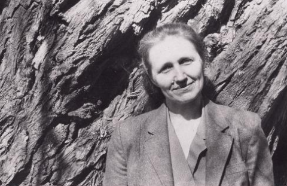

# Sissejuhatus

Luuletuste autor on Lea Tabur. Kogumik on alla laetav [PDF](https://www.gitbook.com/download/pdf/book/luule/lea-luuletused), [Mobi](https://www.gitbook.com/download/mobi/book/luule/lea-luuletused) ja [ePub](https://www.gitbook.com/download/epub/book/luule/lea-luuletused) formaadis.

_Foto: juuni 1993._

## 1986

* [Mu laulud võibolla ei kaiku](mu-laulud-voibolla-ei-kaiku.md)
* [Selle helekollase paju](selle-helekollase-paju.md)
* [Leidsin ühe nooruse](leidsin-uehe-nooruse.md)
* [Oh sina õiterüüs õunapuu](oh-sina-oiterueues-ounapuu.md)
* [Maalaps, marjuke](maalaps-marjuke.md) \(viisistatud, [Eastwinds: "Maalaps Marjuke"](https://eastwinds.bandcamp.com/track/maalaps-marjuke)\)
* [Üks peremehetundeta rahvas](ueks-peremehetundeta-rahvas.md)
* [Vahel harva](vahel-harva.md)
* [Mida olen ma teinud](mida-olen-ma-teinud.md)
* [Selle lihtsa tõeni jõuda](selle-lihtsa-toeni-jouda.md)
* [Üks kaktus kasvas aknalaual potis](ueks-kaktus-kasvas-aknalaual-potis.md)

## 1987

* [Ma pole veel kohale jõudnud](ma-pole-veel-kohale-joudnud.md)
* [See talv on selleks korraks jälle möödas](see-talv-on-selleks-korraks-jaelle-moeoedas.md)
* [Sa, väikene inimene](sa-vaeikene-inimene.md)
* [Ilmamere rannal](ilmamere-rannal.md)
* [Ääremaa](aeaeremaa.md)
* [Loitsud](loitsud.md)
* [Metsahällilaul](metsahaellilaul.md) \(viisistatud, [Eastwinds: "Blame Lulu Peanuts"](https://eastwinds.bandcamp.com/track/blame-lulu-peanuts)\)
* [Mu elu on nii lihtsalt keeruline](mu-elu-on-nii-lihtsalt-keeruline.md)
* [Las ma olen lihtsameelne](las-ma-olen-lihtsameelne.md)
* [Eluvesi](eluvesi.md)
* [Lõõgastumine](loogastumine.md)
* [Allegooria](allegooria.md)
* [Nii nagu armastav naine](nii-nagu-armastav-naine.md)
* [Küünte ja hammaste](kueuente-ja-hammaste.md)
* [Usalda mu vaistu vahel harva!](usalda-mu-vaistu-vahel-harva.md)
* [Mu unistus](mu-unistus.md)
* [Paber kannatab kõike](paber-kannatab-koike.md)
* [Kas kaua mõtleme veel ..](kas-kaua-motleme-veel.md)
* [See võlatunne, mis jääb](see-volatunne-mis-jaeaeb.md)
* [Üks väike mõte olla võib see säde](ueks-vaeike-mote-olla-voib-see-saede.md)

## 1988

* [Anna andeks](anna-andeks.md)
* [Igaüks](igaueks.md)
* [Et läbi murda sellest suluseisust](et-laebi-murda-sellest-suluseisust.md)

## 1989

* [Emajõgi](emajogi.md)
* [Äratamine](aeratamine.md)
* [Olen varas ja varastan hetki](olen-varas-ja-varastan-hetki.md)
* [Köieltantsija](koeieltantsija.md)
* [Aja\(stu\) taju](ajastu-taju.md)
* [Ses külas polnud kirikukella kaja](ses-kuelas-polnud-kirikukella-kaja.md)

## 1990

* [Kivikarbi kuninganna](kivikarbi-kuninganna.md)
* [Elus eksida võime vaid korra](elus-eksida-voime-vaid-korra.md)

## 1993

* [Naiselikult](naiselikult.md)

## 1995

* [Kui täiuslik on väike lumehelves](kui-taeiuslik-on-vaeike-lumehelves.md)

## 1996

* [Elu näitab peegelpilte](elu-naeitab-peegelpilte.md)
* [Otsides suurt armastust](otsides-suurt-armastust.md)

## 1997

* [Lähen linnuteele mööda valget rada](laehen-linnuteele-moeoeda-valget-rada.md)
* [Ja vaikusest sai hommik - sigin-sagin](ja-vaikusest-sai-hommik-sigin-sagin.md)
* [Mu hing saab toitu tunde tugevusest](mu-hing-saab-toitu-tunde-tugevusest.md)

## 1998

* [Erisugused](erisugused.md)
* [Vaimudetund](vaimudetund.md)
* [Me räägime miljardis keeles](me-raeaegime-miljardis-keeles.md)
* [Olemine on kingitus](olemine-on-kingitus.md)
* [Üks ärkamine](ueks-aerkamine.md)
* [Mis maksab üks kuulujutt?](mis-maksab-ueks-kuulujutt.md)
* [Maa ja taeva piiril](maa-ja-taeva-piiril.md)
* [Vaikus ja värvid](vaikus-ja-vaervid.md)
* [Me mäletame, kuidas raha teha](me-maeletame-kuidas-raha-teha.md)
* [Miks kostab mu kõrvu kusagilt](miks-kostab-mu-korvu-kusagilt.md)
* [On jälle sügis](on-jaelle-suegis.md)
* [Tuleingel](tuleingel.md)
* [Nukralt hiilib nurki mööda](nukralt-hiilib-nurki-moeoeda.md)
* [Saunaskäik](saunaskaeik.md)
* [Igast koduõuest alguse saab rada](igast-koduouest-alguse-saab-rada.md)
* [Otsisin armastust sealt](otsisin-armastust-sealt.md)

## 1999

* [Puudutus](puudutus.md)
* [Suutmata mõelda](suutmata-moelda.md)
* [Elu](elu.md)
* [Võid mõelda ennast](void-moelda-ennast.md)
* [Vaid lootus, et midagi muutub](vaid-lootus-et-midagi-muutub.md)
* [Me oleme tulnud ja olnud](me-oleme-tulnud-ja-olnud.md)
* [Kivist loomaaed I](kivist-loomaaed-i.md)
* [Lupiinide valged küünlad](lupiinide-valged-kueuenlad.md)
* [Tahan astuda muusika sisse](tahan-astuda-muusika-sisse.md)
* [Sügislill - lootuse lill](suegislill-lootuse-lill.md)
* [Me oleme Päikese lapsed](me-oleme-paeikese-lapsed.md)

## 2000

* [Muru kasvab mu liigestest läbi](muru-kasvab-mu-liigestest-laebi.md)
* [Nagu sõbralikud haldjad](nagu-sobralikud-haldjad.md)
* [Paljulapseline](paljulapseline.md)
* [Valik \(igavene\)](valik-igavene.md)
* [Liivakell](liivakell.md)
* [Usutunnistus](usutunnistus.md)
* [Ammusele sõbrale](ammusele-sobrale.md)
* [Kivist loomaaed II](kivist-loomaaed-ii.md)
* [Ma armastusest](ma-armastusest.md)
* [Õdak](odak.md)
* [Juula](juula.md)
* [Kui keegi ei vaja](kui-keegi-ei-vaja.md)
* [Luuletaja](luuletaja.md)
* [Panen sõnadesse saatust](panen-sonadesse-saatust.md)
* [Kõigil meist on ülesanne](koigil-meist-on-uelesanne.md)
* [Dreiseri 'Õde Carry' Eestimaal](dreiseri-ode-carry-eestimaal.md)
* [Mõne hetke teed sa mulle](mone-hetke-teed-sa-mulle.md)
* [Ma ajaloo kirjutaks ümber](ma-ajaloo-kirjutaks-uember.md)
* [Igaühel](igauehel.md)
* [Lootus](lootus.md)
* [Uitmõte](uitmote.md)
* [Viimaks](viimaks.md)
* [Kes ütleks?](kes-uetleks.md)
* [Üle läve](uele-laeve.md)
* [Virvele](virvele.md)
* [Tuulest ..](tuulest.md)
* [Mitte miski](mitte-miski.md)
* [Olemise jäljed](olemise-jaeljed.md)
* [Las saisva nee suu](las-saisva-nee-suu.md)
* [Minu kotuse kiil](minu-kotuse-kiil.md)

## 2001

* [Igal hommikul ärgates](igal-hommikul-aergates.md)
* [Sõbrale](sobrale.md)
* [Sind imetlen ..](sind-imetlen.md)
* [Esimene armastus](esimene-armastus.md)
* [Kuidas](kuidas.md)
* [Kui ma enam](kui-ma-enam.md)
* [Linnuke](linnuke.md)
* [Vihm piserdab](vihm-piserdab.md)
* [Valgus](valgus.md)
* [Võib-olla](voib-olla.md)
* [Sind armastanud](sind-armastanud.md)
* [Sünnipäevaks kingi](suennipaeevaks-kingi.md)
* [Hetk](hetk.md)
* [Nägin ..](naegin.md)
* [Vastandid](vastandid.md)
* [Ootus \(Minu kallitele\)](ootus-minu-kallitele.md)
* [Süütuse presumptsioon](sueuetuse-presumptsioon.md)
* [Pidemeta](pidemeta.md)
* [Heledad laulud](heledad-laulud.md)
* [Õrnus](ornus.md)
* [Võrratu maa](vorratu-maa.md)
* [Pärast tragöödiat](paerast-tragoeoediat.md)
* [Me oleme alati](me-oleme-alati.md)
* [Mõtted](motted.md)
* [Lasen igatsuse](lasen-igatsuse.md)
* [Jumalik ettehooldus](jumalik-ettehooldus.md)
* [Unistuste tuhast](unistuste-tuhast.md)
* [Suhted](suhted.md)
* [Oktoober I](oktoober-i.md)
* [Aastaaegade maagia](aastaaegade-maagia.md)
* [Ma kõnelen sinuga](ma-konelen-sinuga.md)
* [Oktoober II](oktoober-ii.md)
* [Seaduspära](seaduspaera.md)
* [Kuristikust](kuristikust.md)
* [Vahel](vahel.md)
* [Autoportree](autoportree.md)
* [Ainult nii](ainult-nii.md)
* [Sa oled raami sees](sa-oled-raami-sees.md)

## 2002

* [Südamega](suedamega.md)
* [Sinusoid](sinusoid.md)
* [Natuke](natuke.md)
* [Millest räägib](millest-raeaegib.md)
* [Kusagilt tulles](kusagilt-tulles.md)
* [Iga päev](iga-paeev.md)
* [Nii ..](nii.md)
* [Nüüd](nueued.md)
* [Mis on õnn?](mis-on-onn.md)
* [Ühele neiuhakatisele](uehele-neiuhakatisele.md)
* [Sina ei tahtnud](sina-ei-tahtnud.md)
* [Ei meil pole kerge kellelgi](ei-meil-pole-kerge-kellelgi.md)
* [Selle ilmaga](selle-ilmaga.md)
* [Veebruar](veebruar.md)
* [Me kõigest loome ..](me-koigest-loome.md)
* [Otsin sind ikka üles](otsin-sind-ikka-ueles.md)
* [Kodu](kodu.md)
* [Kõige ..](koige.md)
* [Tõelus](toelus.md)
* [\*\*\*\*\*](undefined.md)
* [See oligi nii ..](see-oligi-nii.md)
* [Maarahvas, metsarahvas](maarahvas-metsarahvas.md)
* [Haldjate naerust](haldjate-naerust.md)
* [Igapäevane elu](igapaeevane-elu.md)
* [Mu unedesse ..](mu-unedesse.md)

## 2003

* [Äratundmine](aeratundmine.md)

## 2004

* [Salakirjad](salakirjad.md)
* [Ootus](ootus.md)
* [Vihm teeb vahe vahele](vihm-teeb-vahe-vahele.md)
* [Läkitus](laekitus.md)
* [Teadmatus](teadmatus.md)

## 2005

* [Jõulumõte](joulumote.md)
* [Suveöö](suveoeoe.md)
* [Ei või iial teada ..](ei-voi-iial-teada.md)
* [Sõnum](sonum.md)
* [Õhkõrn](ohkorn.md)
* [Kui ma suudan](kui-ma-suudan.md)
* [Nagu ikka ..](nagu-ikka.md)
* [Sõnajalahullus](sonajalahullus.md)
* [Murdekoht](murdekoht.md)

## 2006

* [Oh, Iirimaa!](oh-iirimaa.md)
* [Meenutades](meenutades.md)
* [Salamisi](salamisi.md)
* [Eks kõik ju tea](eks-koik-ju-tea.md)
* [Aktsendid](aktsendid.md) \(viisistatud, [Eastwinds: "Chakwe"](https://eastwinds.bandcamp.com/track/chakwe)\)
* [Tuulelaulud](tuulelaulud.md)
* [Vastlapäevane](vastlapaeevane.md)
* [Ajalugu - aja lugu](ajalugu-aja-lugu.md)
* [See võrratu rahu](see-vorratu-rahu.md)
* [Ma aina otsisin ..](ma-aina-otsisin.md)
* [Heade Mõtete Linn](heade-motete-linn.md)
* [Hingepuu](hingepuu.md)
* [Lumeta](lumeta.md)
* [Vana Halli vastu](vana-halli-vastu.md) \(viisistatud, [Eastwinds: "The Gift"](https://eastwinds.bandcamp.com/track/the-gift-2)
* [Igavesti](igavesti.md)
* [Ikka oodates](ikka-oodates.md)

## 2007

* [Õnnelik ..](onnelik.md)
* [Jäälilled](jaeaelilled.md)
* [Tänumeeles](taenumeeles.md)
* [Heale sõbrale](heale-sobrale.md)
* [Aprillinali](aprillinali.md)
* [Iseolemise aeg](iseolemise-aeg.md)
* [Vabaks ..](vabaks.md)
* [Otsides ja leides](otsides-ja-leides.md)
* [Tähesajus](taehesajus.md)
* [Hellusega ..](hellusega.md)
* [Jumalikult](jumalikult.md)
* [Kas sa kuulsid ..](kas-sa-kuulsid.md)

## 2016

* [Vaikuse ime](vaikuse-ime.md)

